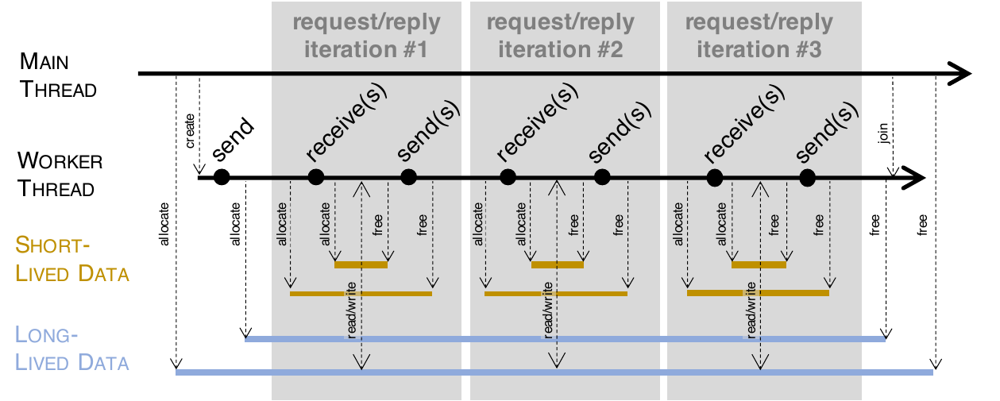

# StateAFL: A Coverage-Driven (Greybox) Fuzzer for Stateful Network Protocols
StateAFL is a fuzzer designed for network servers. It extends the original idea of the AFL fuzzer, which automatically evolves fuzz inputs to maximize code coverage. In addition to code coverage, StateAFL seeks to maximize protocol state coverage.

StateAFL automatically infers the current protocol state of the server. At compile-time, it instruments the target server with probes on memory allocations and network I/O operations. At run-time, it takes snapshots of long-lived data within process memory for each protocol iteration (see figure), and it applies fuzzy hashing to map the in-memory state to a unique protocol state.




More information about the internals of StateAFL are available in the following [research paper](https://arxiv.org/pdf/2110.06253.pdf).

StateAFL has been implemented on top of the codebase of [AFL](http://lcamtuf.coredump.cx/afl/) and [AFLnet](https://github.com/aflnet/aflnet). To fuzz a server, it should be compiled using the `afl-clang-fast` tool in this project, to perform a compiler pass for instrumenting the target.

# Licences

StateAFL is licensed under [Apache License, Version 2.0](https://www.apache.org/licenses/LICENSE-2.0).

StateAFL extends [AFLnet](https://github.com/aflnet/aflnet), written and maintained by Van-Thuan Pham <<thuan.pham@unimelb.edu.au>>, and [American Fuzzy Lop](http://lcamtuf.coredump.cx/afl/) written and maintained by Michał Zalewski <<lcamtuf@google.com>>. For details about these fuzzers, we refer to [README-AFLnet.md](README-AFLnet.md) and [README-AFL.md](README-AFL.md).

StateAFL uses the [Trend Micro Locality Sensitive Hash (TLSH) library](https://github.com/trendmicro/tlsh/) and the [MVPTree C library](https://github.com/michaelmior/mvptree/) for fuzzy hashing and for nearest neighbor search. StateAFL uses the [Containers library](https://github.com/bkthomps/Containers) for map, queue, and set data structures.

* **AFL**: Copyright 2013, 2014, 2015, 2016 Google Inc. All rights reserved. Released under terms and conditions of [Apache License, Version 2.0](https://www.apache.org/licenses/LICENSE-2.0).

* **TLSH**: Copyright 2013 Trend Micro Incorporated. Released under terms and conditions of [Apache License, Version 2.0](https://www.apache.org/licenses/LICENSE-2.0).

* **MVPTree C library**: Copyright 2008-2009 by D. Grant Starkweather. Released under terms and conditions of [GNU Public License, Version 3.0](https://www.gnu.org/licenses/gpl-3.0.txt).

* **Containers library**: Copyright (c) 2017-2020 Bailey Thompson. Released under terms and conditions of [MIT License](https://opensource.org/licenses/MIT).


# ProFuzzBench

If you want to run some experiments quickly, please take a look at [ProFuzzBench](https://github.com/profuzzbench/profuzzbench). ProFuzzBench includes a suite of representative open-source network servers for popular protocols (e.g., TLS, SSH, SMTP, FTP, SIP), and tools to automate experimentation. StateAFL has been integrated into that benchmark.


# Installation (Tested on Ubuntu 18.04 & 16.04 64-bit)

## Prerequisites

```bash
# Install clang (required by afl-clang-fast)
sudo apt-get install clang
# Install graphviz development
sudo apt-get install graphviz-dev
```

## StateAFL

Download StateAFL and compile it. We have tested StateAFL on Ubuntu 18.04 and Ubuntu 16.04 64-bit and it would also work on all environments that support the vanilla AFL and [graphviz](https://graphviz.org).

```bash
# First, clone this StateAFL repository to a folder named stateafl
git clone <links to the repository> stateafl
# Then move to the source code folder
cd stateafl
make clean all
cd llvm_mode
# The following make command may not work if llvm-config cannot be found
# To fix this issue, just set the LLVM_CONFIG env. variable to the specific llvm-config version on your machine
# On Ubuntu 18.04, it could be llvm-config-6.0 if you have installed clang using apt-get
make
# Move to StateAFL's parent folder
cd ../..
export STATEAFL=$(pwd)/stateafl
```

## Setup PATH environment variables

```bash
export PATH=$STATEAFL:$PATH
export AFL_PATH=$STATEAFL
```

# Usage

StateAFL can be run using the same command line options of AFLNet and AFL. Run ```afl-fuzz --help``` to see all options. Please also see [README-AFLnet.md](README-AFLnet.md) for more information.

- ***-N netinfo***: server information (e.g., tcp://127.0.0.1/8554)

- ***-P protocol***: application protocol to be tested (e.g., RTSP, FTP, DTLS12, DNS, DICOM, SMTP, SSH, TLS, DAAP-HTTP, SIP)

- ***-D usec***: (optional) waiting time (in microseconds) for the server to complete its initialization 

- ***-K*** : (optional) send SIGTERM signal to gracefully terminate the server after consuming all request messages

- ***-E*** : (optional) enable state aware mode

- ***-R*** : (optional) enable region-level mutation operators

- ***-F*** : (optional) enable false negative reduction mode

- ***-c script*** : (optional) name or full path to a script for server cleanup

- ***-q algo***: (optional) state selection algorithm (e.g., 1. RANDOM_SELECTION, 2. ROUND_ROBIN, 3. FAVOR)

- ***-s algo***: (optional) seed selection algorithm (e.g., 1. RANDOM_SELECTION, 2. ROUND_ROBIN, 3. FAVOR)


Example command: 
```bash
afl-fuzz -d -i in -o out -N <server info> -x <dictionary file> -P <protocol> -D 10000 -q 3 -s 3 -E -K -R <executable binary and its arguments (e.g., port number)>
```


